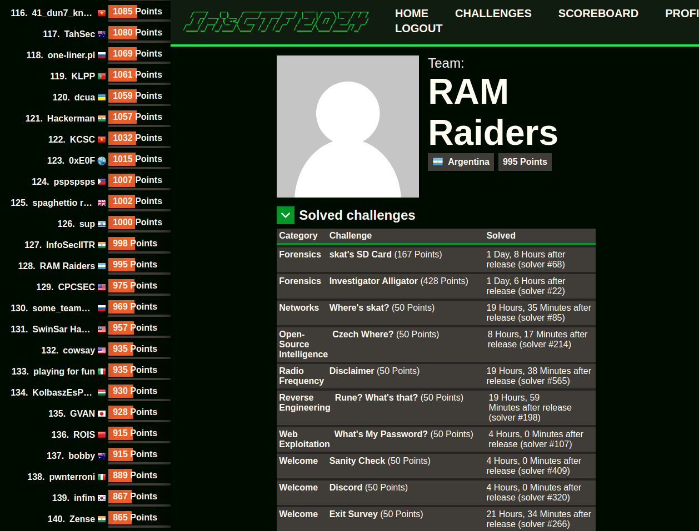

# Iris CTF 2024

## 🇬🇧 English

The writeups in this repository correspond to the **Iris CTF 2024** event, organized by [IrisSec](https://irissec.xyz/), held from January 6th, 2024 to January 8th, 2024.

### Event Details
- CTFtime event URL: https://ctftime.org/event/2085
- Event URL: https://2024.irisc.tf/home

---

The following challenges were solved:

| Challenge | Category |
| --- | :---:
| ✅ skat's SD Card | forensics |
| ✅ Investigator Alligator | forensics |
| ✅ Where's skat? | networks |
| ✅ Czech Where? | Open-Source Intelligence |
| ✅ Rune? What's that? | Reverse Engineering |
| ✅ What's My Password? | Web Exploitation |

Team URL: https://2024.irisc.tf/user?id=92

### Subfolder Structure

Each subfolder in this repository corresponds to a challenge and contains the following files:
- `writeup.md`: The detailed writeup for the challenge.
- `solve.py`: The script used to solve the challenge.
- `requirements.txt`: The required dependencies to run the solve script (if applicable).
- Additional files, such as images or resources used in the writeup, are in the resources directory.
---

## 🇪🇸 Español

Los writeups de este repositorio corresponden al evento **Iris CTF 2024**, organizado por [IrisSec](https://irissec.xyz/), desarrollado entre el 06/01/2024 y el 08/01/2024.

### Datos del evento
- CTFtime event URL: https://ctftime.org/event/2085
- Event URL: https://2024.irisc.tf/home

---

Fueron resueltos los siguientes challenges:

| Challenge | Categoría |
| --- | :---:
| ✅ skat's SD Card | forensics |
| ✅ Investigator Alligator | forensics |
| ✅ Where's skat? | networks |
| ✅ Czech Where? | Open-Source Intelligence |
| ✅ Rune? What's that? | Reverse Engineering |
| ✅ What's My Password? | Web Exploitation |

URL del team: https://2024.irisc.tf/user?id=92

### Estructura de Subcarpetas

Cada subcarpeta en este repositorio corresponde a un desafío y contiene los siguientes archivos:
- `writeup_es.md`: El writeup detallado del desafío.
- `solve.py`: El script utilizado para resolver el desafío.
- `requirements.txt`: Las dependencias necesarias para ejecutar el script de resolución (si aplica).
- Archivos adicionales como imágenes o recursos utilizados en el writeup, en el directorio resources.
