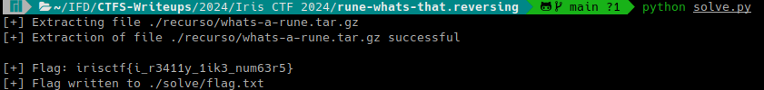

# Rune? What's that? (Iris CTF 2024 - Reverse Engineering)

## Challenge
Rune? Like the ancient alphabet?

### Resource
[Download whats-a-rune.tar.gz](https://cdn.2024.irisc.tf/whats-a-rune.tar.gz)

## Manual Solve

Extract the whats-a-rune.tar.gz file:

```bash
7z x ./resource/whats-a-rune.tar.gz -o./resource/
```

```bash
7z x ./resource/whats-a-rune.tar -o./resource/
```

Open /resource/whats-a-rune/

Let's inspect the main.go code:

```go
package main

import (
	"fmt"
	"os"
	"strings"
)

var flag = "irisctf{this_is_not_the_real_flag}"

func init() {
	runed := []string{}
	z := rune(0)

	for _, v := range flag {
		runed = append(runed, string(v+z))
		z = v
	}

	flag = strings.Join(runed, "")
}

func main() {
	file, err := os.OpenFile("the", os.O_RDWR|os.O_CREATE, 0644)
	if err != nil {
		fmt.Println(err)
		return
	}

	defer file.Close()
	if _, err := file.Write([]byte(flag)); err != nil {
		fmt.Println(err)
		return
	}
}
```

The file "the" contains the flag after the init() function has been applied to it. To recover the flag we need to perform the inverse operation of init().

We write the script [solve.py](solve.py)

The inverse operation is:

```py
z = 0

for v in flag:
    runed.append(chr(ord(v) - z))
    z = ord(v) - z
```



### Flag
Flag: `irisctf{i_r3411y_1ik3_num63r5}`


## Solution using solve.py
### Requirements
The script requires multiple packages. Requirements can be installed with the following command:

```bash
pip install -r requirements.txt
```

### Execution
Run the following command:

```bash
python solve.py
```

It will show the flag in the output and write it to the flag.txt file inside the ./solve relative directory.

> Note: the script will download the resource if not present in ./resource.

