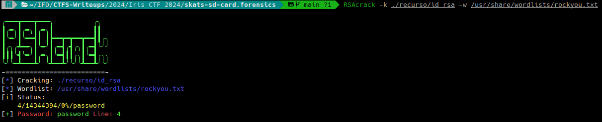
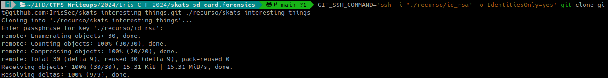
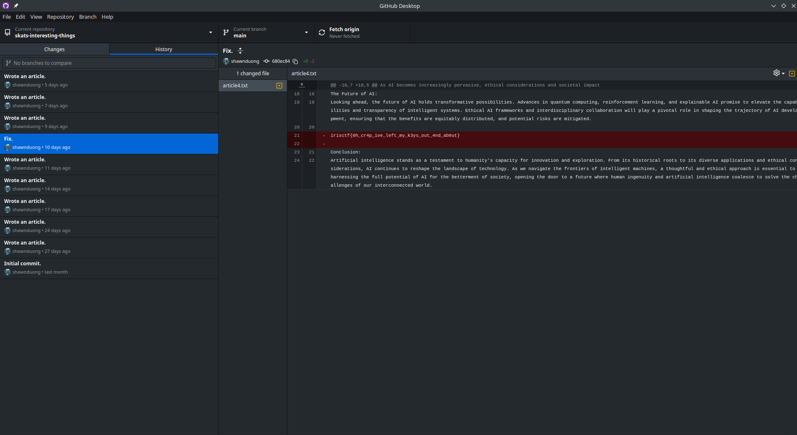
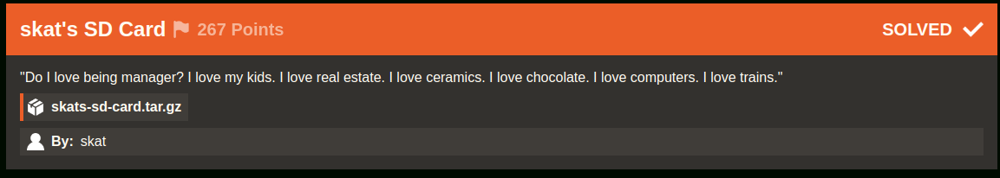
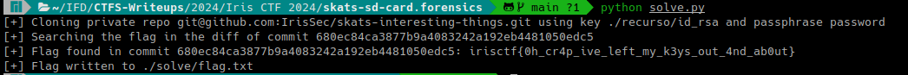

# skat's SD Card (Iris CTF 2024 - Forensics)

## Challenge
"Do I love being manager? I love my kids. I love real estate. I love ceramics. I love chocolate. I love computers. I love trains."

### Resource
[Download skats-sd-card.tar.gz](https://cdn.2024.irisc.tf/skats-sd-card.tar.gz)

> Note: The complete resource is not included in the repository due to its 1.7GB size. Some files extracted from the disk image of the original resource are included.

## Manual Solve

Extract the skats-sd-card.tar.gz file:

```bash
7z x skats-sd-card.tar.gz
```

```bash
7z x mmcblk0p2.img.zip
```

Mount mmcblk0p2.img:

```bash
sudo mkdir /mnt/skats-sd-card && sudo mount -o ro ./mmcblk0p2.img /mnt/skats-sd-card
```

In /skats-sd-card/home/skat/ we find the .bash_history for user skat:

```bash
ip a
ps -aux
ls */
tree
tree -a
ssh-keygen 
cat .ssh/id_rsa.pub
cd Downloads/
git clone
git clone git@github.com:IrisSec/skats-interesting-things.git
cd skats-interesting-things/
ls
cat README.md 
cat article6.txt 
cd ../
rm -rf skats-interesting-things/
exit
```

The repository https://github.com/irissec/skats-interesting-things is private, so it cannot be cloned without the private ssh key.
In /skats-sd-card/home/skat/.ssh we find the id_rsa file, so we'll try cloning the repository using the private key found.

```bash
GIT_SSH_COMMAND='ssh -i "./resource/id_rsa" -o IdentitiesOnly=yes' git clone git@github.com:IrisSec/skats-interesting-things.git ./resource/skats-interesting-things
Cloning into './resource/skats-interesting-things'...
Enter passphrase for key './resource/id_rsa':
```

The issue is that we need the passphrase, which is unknown.
To obtain the passphrase we can use RSACrack: https://github.com/d4t4s3c/RSAcrack
It can be installed as follows:

```bash
sudo wget --no-check-certificate -q "https://raw.githubusercontent.com/d4t4s3c/RSAcrack/main/RSAcrack" -O /usr/bin/RSAcrack && sudo chmod +x /usr/bin/RSAcrack
```

Then we run the tool, using the rockyou wordlist:

```bash
RSAcrack -k ./resource/id_rsa -w /usr/share/wordlists/rockyou.txt
```



The password was obtained: `password`

Now we try cloning the repository. Enter the passphrase `password`

```bash
GIT_SSH_COMMAND='ssh -i "./resource/id_rsa" -o IdentitiesOnly=yes' git clone git@github.com:IrisSec/skats-interesting-things.git ./resource/skats-interesting-things
```



We open the repo in [GitHub Desktop](https://desktop.github.com/) to easily view the commit history and find the "Fix" commit, in which we find the flag in the diff:



### Flag
Flag: `irisctf{0h_cr4p_ive_left_my_k3ys_out_4nd_ab0ut}`



## Solution using solve.py
### Requirements
The script requires the pexpect package.

> NOTE: pexpect.spawn (used to automatically enter the passphrase, only works on Linux).

Requirements can be installed with the following command:

```bash
pip install -r requirements.txt
```

### Execution
Run the following command:

```bash
python solve.py
```

It will show the flag in the output and write it to the flag.txt file inside the ./solve relative directory.

