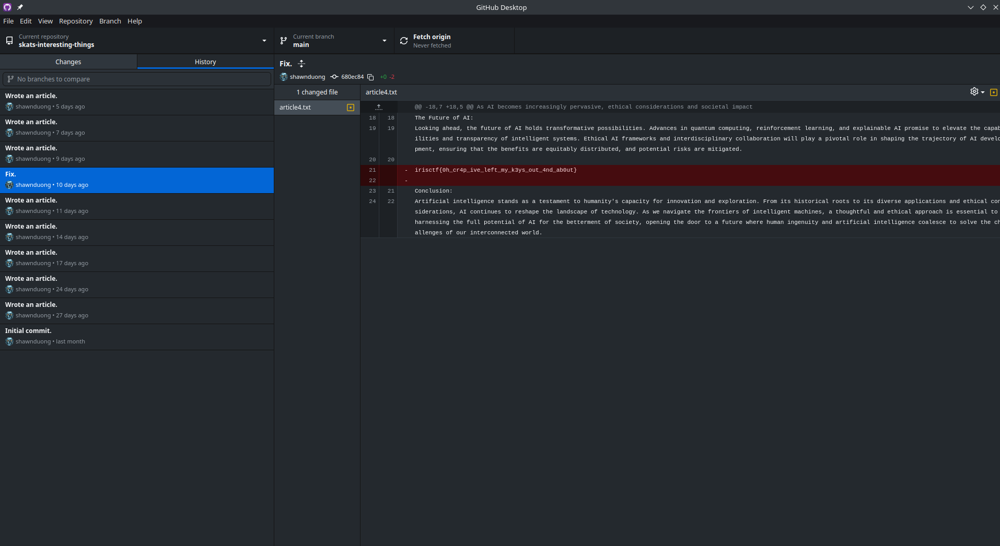

# skat's SD Card (Iris CTF 2024 - Forensics)

## Challenge
"Do I love being manager? I love my kids. I love real estate. I love ceramics. I love chocolate. I love computers. I love trains."

### Resource
[Download skats-sd-card.tar.gz](https://cdn.2024.irisc.tf/skats-sd-card.tar.gz)

> Nota: No se incluye el recurso completo en el repositorio debido a su tamaño de 1,7GB. Se incluyen algunos archivos extraidos de la imagen de disco del recurso original.

## Solve manual

Extraemos el archivo skats-sd-card.tar.gz:

```bash
7z x skats-sd-card.tar.gz
```

```bash
7z x mmcblk0p2.img.zip
```

Montamos mmcblk0p2.img:

```bash
sudo mkdir /mnt/skats-sd-card && sudo mount -o ro ./mmcblk0p2.img /mnt/skats-sd-card
```

En /skats-sd-card/home/skat/ encontramos el .bash_history para el usuario skat:

```bash
ip a
ps -aux
ls */
tree
tree -a
ssh-keygen 
cat .ssh/id_rsa.pub
cd Downloads/
git clone
git clone git@github.com:IrisSec/skats-interesting-things.git
cd skats-interesting-things/
ls
cat README.md 
cat article6.txt 
cd ../
ls
rm -rf skats-interesting-things/
exit
```

El repositorio https://github.com/irissec/skats-interesting-things es privado, por lo tanto no es posible clonarlo sin la clave ssh privada.
En /skats-sd-card/home/skat/.ssh se encuentra el archivo id_rsa, por lo tanto se probará clonar el repositorio usando la clave privada encontrada.

```bash
GIT_SSH_COMMAND='ssh -i "./resource/id_rsa" -o IdentitiesOnly=yes' git clone git@github.com:IrisSec/skats-interesting-things.git ./resource/skats-interesting-things
Cloning into './resource/skats-interesting-things'...
Enter passphrase for key './resource/id_rsa':
```

El problema es que se necesita la passphrase, la cual es desconocida.
Para obtener la passphrase se puede utilizar RSACrack: https://github.com/d4t4s3c/RSAcrack
Se instala de la siguiente forma:

```bash
sudo wget --no-check-certificate -q "https://raw.githubusercontent.com/d4t4s3c/RSAcrack/main/RSAcrack" -O /usr/bin/RSAcrack && sudo chmod +x /usr/bin/RSAcrack
```

Luego ejecutamos la tool, utilizando la wordlist rockyou:

```bash
RSAcrack -k ./resource/id_rsa -w /usr/share/wordlists/rockyou.txt
```


Se obtuvo la password: `password`

Ahora sí, se prueba clonar el repositorio. Ingresamos la passphrase `password`

```bash
GIT_SSH_COMMAND='ssh -i "./resource/id_rsa" -o IdentitiesOnly=yes' git clone git@github.com:IrisSec/skats-interesting-things.git ./resource/skats-interesting-things
```


Abrimos el repo en [GitHub Desktop](https://desktop.github.com/) para visualizar con facilidad el historial de commits y encontramos el commit "Fix", en el cual en el diff se encuentra la flag:



### Flag
Flag: `irisctf{0h_cr4p_ive_left_my_k3ys_out_4nd_ab0ut}`


## Solve utilizando solve.py
### Requerimientos
El script requiere el package pexpect.

> NOTA: pexpect.spawn (utilizado para ingresar la passphrase automáticamente, funciona únicamente en linux).  

La instalación de requerimientos se realiza con el siguiente comando:

```bash
pip install -r requirements.txt
```

### Ejecución
Se deberá ejecutar el siguiente comando:

```bash
python solve.py
```

Mostrará en el output la flag y escribirá la misma en el archivo flag.txt dentro del directorio relativo ./solve

