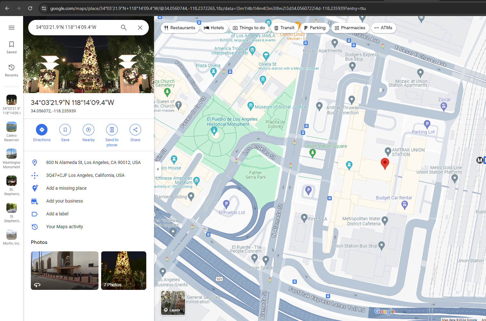

# Where's skat? (Iris CTF 2024 - Networks)

## Challenge
While traveling over the holidays, I was doing some casual wardriving (as I often do). Can you use my capture to find where I went?

> Note: the flag is irisctf{the_location}, where the_location is the full name of my destination location, not the street address. For example, irisctf{Washington_Monument}.  
Note that the flag is not case sensitive.

> Hint! If you're relying on Google Maps to get location names, be careful that it doesn't get lost in translation (for the non-Americans).

### Resource
[wheres-skat.tar.gz](https://cdn.2024.irisc.tf/wheres-skat.tar.gz)

## Solve manual

Extraemos el archivo whats-a-rune.tar.gz:

```bash
7z x ./recurso/wheres-skat.tar.gz -o./recurso/
```

```bash
7z x ./recurso/wheres-skat.tar -o./recurso/
```

```bash
7z x ./recurso/wheres-skat/wheres-skat.zip -o./recurso/
```

Abrimos /recurso/wheres-skat.pcap en Wireshark:


Vemos ssids de redes wifi en la captura. Vemos el bssid de una de las redes en particular.

Utilizamos [geowifi](https://github.com/GONZOsint/geowifi) para buscar las coordenadas por ssid.

Tomamos el bssid de la red de la screenshot anterior: ba:46:9d:1b:28:5e y la buscamos con geowifi.


Obtenemos coordenadas que buscamos en google maps:



Realizamos el mismo procedimiento con el bssid de "USW SOC Guest"


Probamos la ubicación "Los Angeles Union Station" con el formato irisctf{los_angeles_union_station} y la flag es correcta.


### Flag
Flag: `irisctf{los_angeles_union_station}`


## Solve utilizando solve.py
El script requiere múltiples packages. La instalación de requerimientos se realiza con el siguiente comando:

```bash
pip install -r requirements.txt
```

Se deberá ejecutar el siguiente comando:

```bash
python solve.py
```

Mostrará en el output las latitudes y longitudes para algunas BSSID encontradas en la captura, y abrira en el navegador por defecto google maps en las coordenadas encontradas. El usuario deberá observar el mapa para obtener el nombre del lugar.

> Nota: el script descargará el recurso en caso de no estar en ./recurso.  
> Nota: el script descargará geowifi desde su repositorio https://github.com/GONZOsint/geowifi.


