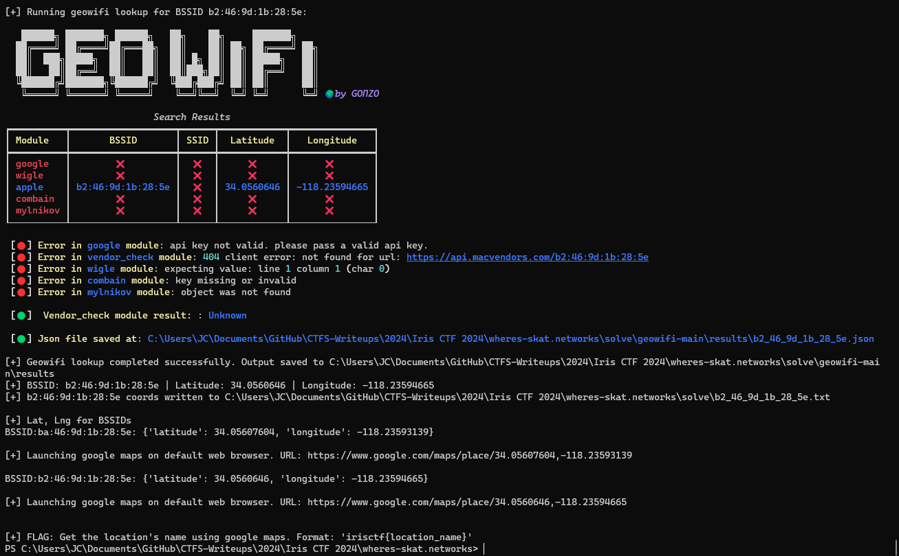

# Where's skat? (Iris CTF 2024 - Networks)

## Challenge
While traveling over the holidays, I was doing some casual wardriving (as I often do). Can you use my capture to find where I went?

> Note: the flag is irisctf{the_location}, where the_location is the full name of my destination location, not the street address. For example, irisctf{Washington_Monument}.  
Note that the flag is not case sensitive.

> Hint! If you're relying on Google Maps to get location names, be careful that it doesn't get lost in translation (for the non-Americans).

### Resource
[wheres-skat.tar.gz](https://cdn.2024.irisc.tf/wheres-skat.tar.gz)

## Manual Solve

Extract the wheres-skat.tar.gz file:

```bash
7z x ./resource/wheres-skat.tar.gz -o./resource/
```

```bash
7z x ./resource/wheres-skat.tar -o./resource/
```

```bash
7z x ./resource/wheres-skat/wheres-skat.zip -o./resource/
```

Open /resource/wheres-skat.pcap in Wireshark:


We can see WiFi SSIDs in the capture. We notice the BSSID of one particular network.

We use [geowifi](https://github.com/GONZOsint/geowifi) to search coordinates by SSID.

We take the BSSID from the network shown in the previous screenshot: ba:46:9d:1b:28:5e and search it with geowifi.


We get coordinates which we search in Google Maps:


We perform the same procedure with the BSSID of "USW SOC Guest"


We try the location "Los Angeles Union Station" with the format irisctf{los_angeles_union_station} and the flag is correct.

### Flag
Flag: `irisctf{los_angeles_union_station}`


## Solution using solve.py
### Requirements
The script requires multiple packages. Requirements can be installed with the following command:

```bash
pip install -r requirements.txt
```

### Execution
Run the following command:

```bash
python solve.py
```

It will show the latitudes and longitudes for some BSSIDs found in the capture and open Google Maps in the default browser at the found coordinates. The user will need to look at the map to get the name of the location.

> Note: the script will download the resource if not present in ./resource.  
> Note: the script will download geowifi from its repository https://github.com/GONZOsint/geowifi.



